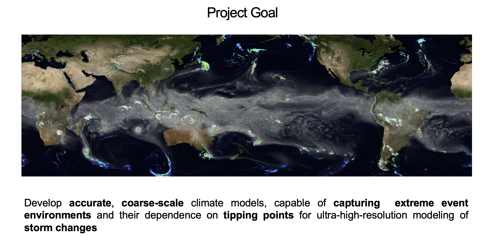
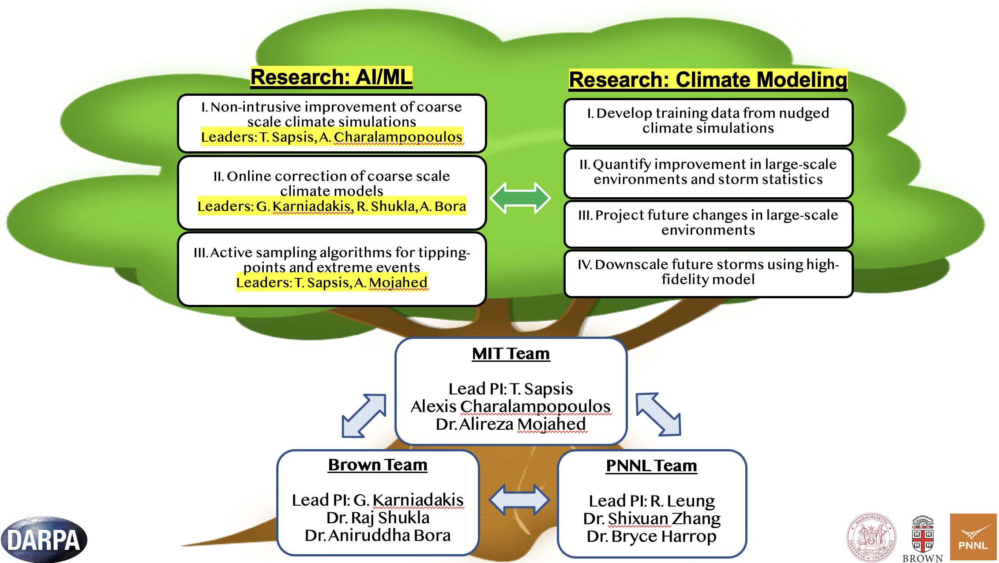

.. Lumache documentation master file, created by
   sphinx-quickstart on Sat Jul 23 10:18:09 2022.
   You can adapt this file completely to your liking, but it should at least
   contain the root `toctree` directive.

.. toctree::
   :maxdepth: 2
   :caption: Contents:

Hybrid Modelling
----------------

.. toctree::
   :maxdepth: 2
   :caption: Contents:
  
  modules/Data
  modules/Extreme_Events
  modules/DeepONet_Online
  modules/LSTM_based_offline_correction
  

Indices and tables
==================

* :ref:`genindex`
* :ref:`modindex`
* :ref:`search`

