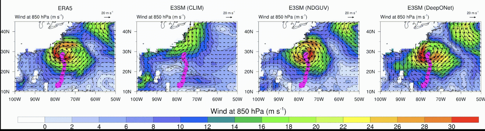
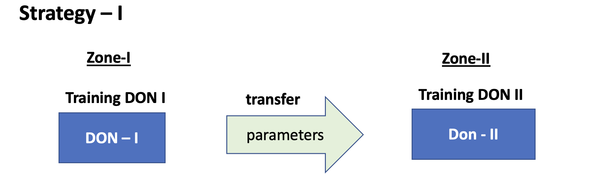

DeepONet for E3SM
=================

Problem Setup for E3SM
----------------------

.. figure:: images/fig_1.png
  :width: 600
  :align: center
  :alt: Alternative text

The main idea is to use a DeepONet to replace the nudging mechanism for the online bias correction for the state variables *U* and *V*.

.. figure:: images/fig_2.png
  :width: 600
  :align: center
  :alt: Alternative text

DeepONet Setup
--------------

The overall process can be divided into three parts:

1. Encode X~bf *(X: state variable, bf: before nudging)*
2. Predict Nudging tendency X~ndg  *(ndg: nudging tendency)* for X~bf in the encoded domain.
3. Decode the X~ndg  to the nudging tendency X~ndg in the original domain.

The over all architecture is shown in the figure below.

.. figure:: images/fig_3.png
  :width: 600
  :align: center
  :alt: Alternative text

Data
----

*State variables* : *U* (East-West wind component) , *V* (North-South wind component)

*Dimension* *(Nz, Nt, Nx, Ny)*, 

where *Nz=72, Nt=248, Nx=70, Ny=70*

For the current test case, we select the folowing patch for the DeepONet training

.. figure:: images/fig_4.png
  :width: 600
  :align: center
  :alt: Alternative text

Code Setup
----------
 
1. Encoder Decoder output
	
	To see the encoder decoder outputs for a particular Field Variable:
			
			* open the job_sbatch file.
			
			* Enter the datapath in which the data is in  DATAPATH=''. For example if you have the data in the path '/Users/abora/NEW_AE_DATA/', then enter DATAPATH='/Users/abora/NEW_AE_DATA/'.
			
			* We have three kinds of data in three different folders
						* 	 'NDG_TEND/' : for the nudging tendency data
						*    'BF_NDG/': for the before nudged data
						*    'REF/' : for the reference data
			    Based on whichver data we want type the folder name in FOLDER_NAME=''. For example if we want the data for nudging tendency enter FOLDER_NAME='NDG_TEND/'.
			    
			* Enter the state variable name in the FIELD="" . For example if you want to see the results for U type FIELD="U".
			
			* Enter the time for which you want to see the plots in PLOT_TIME= . For example you want to see the plot for t=100, then enter PLOT_TIME=100.
			
			* Make an empty folder Figs in same directy as where the code is to save all the figures. 
			
			* Now type sbatch job.sbatch in your terminal.

For the implementation and code click [`here <https://github.com/raj-brown/darpa_climate_code>`_]

Results
-------

  
For the results of the DeepONet click [`here <https://drive.google.com/drive/folders/1rmrz2I5v8Mi5MB3nR90Ny-FyzvdVzx7r?usp=sharing>`_]. This link shows the simulation of the hurricane Sandy in 2012. The results show that the DeepONet can learn the corrective tendency very well and can reproduce the hurrican Sandy.

  
In this [`link <https://drive.google.com/drive/folders/1POGC_GHiZbbVZr2qUorqqn9YIclDyvQm?usp=sharing>`_] you can find the simulation of the nudging tendedncy and its correlation with the nudging tendency used in E3SM.

Online Integration of DeepONet with E3SM
----------------------------------------

Challenges:

1. E3SM codebases is primarily written in FORTRAN 90

2. Most of the deep learning framework provides Python APIs. Therefore, proposed DeepONet model is written in Python.

3. To integrate the DeepONet model in E3SM requires writing forward pass of DeepONet in FORTRAN 90

Solutions:

1. Developed a library for doing encoder, DeepONet and decoder process in FORTRAN 90. 

Here is the [`link <https://github.com/zhangshixuan1987/E3SM/blob/e3smv2.0_for_darpa/components/eam/src/physics/cam/nudging.F90>`_] for the module related to nudging (nudging.f90) in E3SM 

Conclusion
----------

The major ideas for having an online implementation can be enumerated into the following points:

1. For being able to simulate future climate.
2. To see if the correction implemented by the method has better effects on the other variables in the model.

Transfer Learning
-----------------

Previous results shows the effectiveness of the DeepONet for the patch we selected. The next step is to see if this learning can be applied to other areas and how much of training is required if we move to other patches. Keeping this in mind we have selected four zones as shown below.

  
  
  .. figure:: images/fig_8.png
  :width: 600
  :align: center
  :alt: Alternative text

