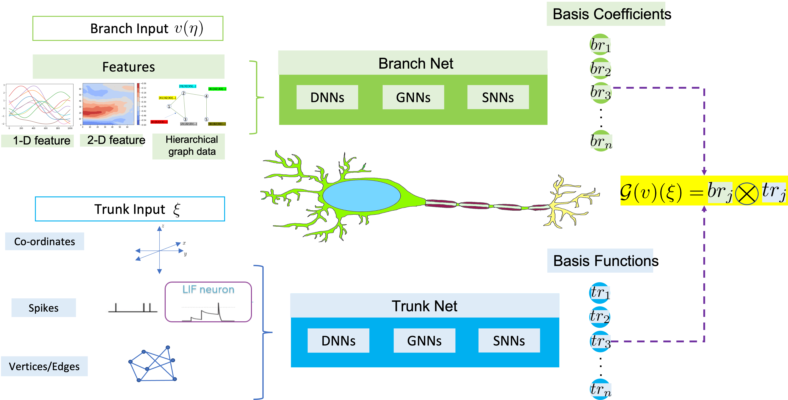
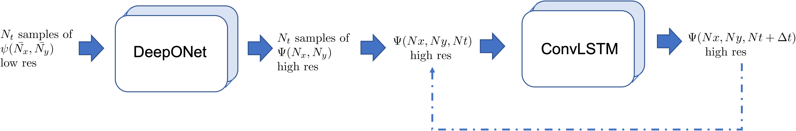
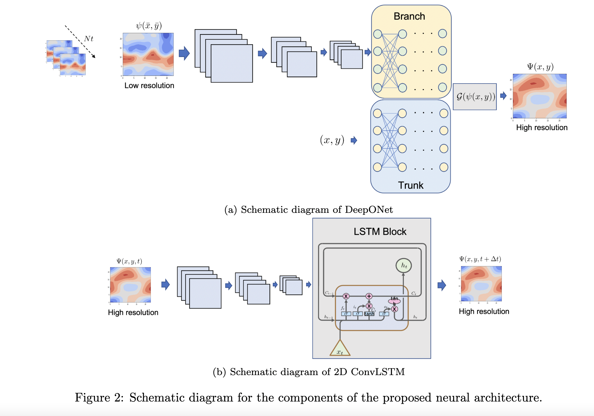
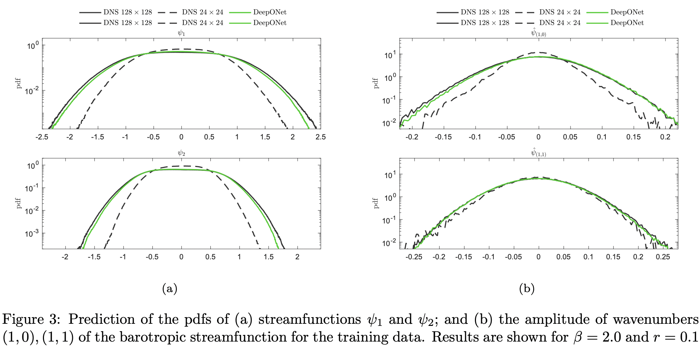
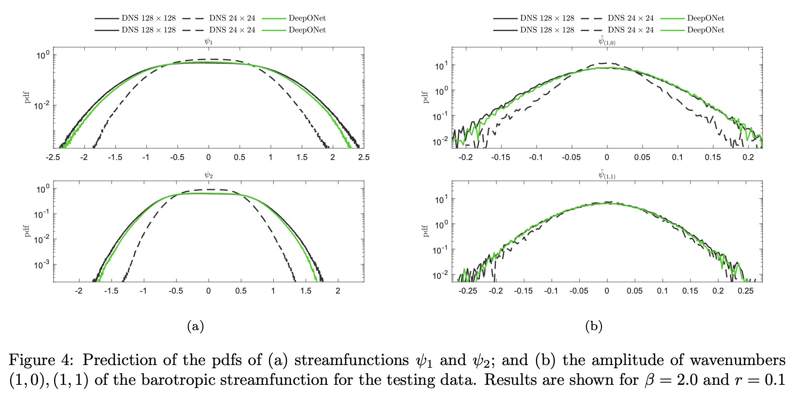
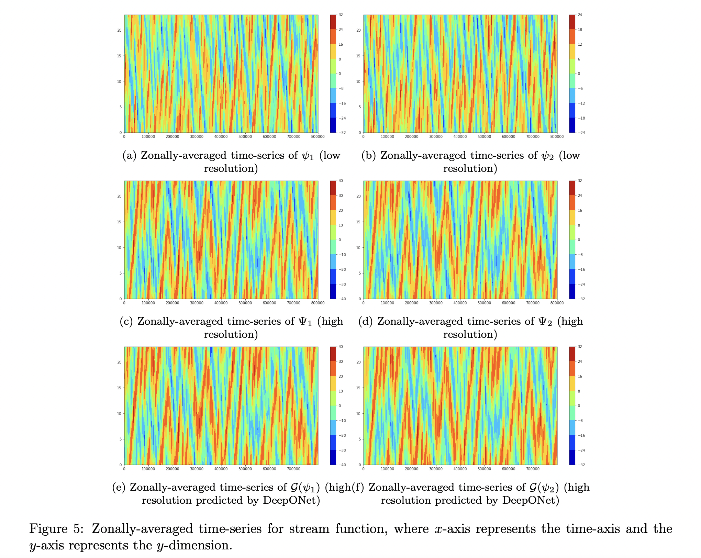
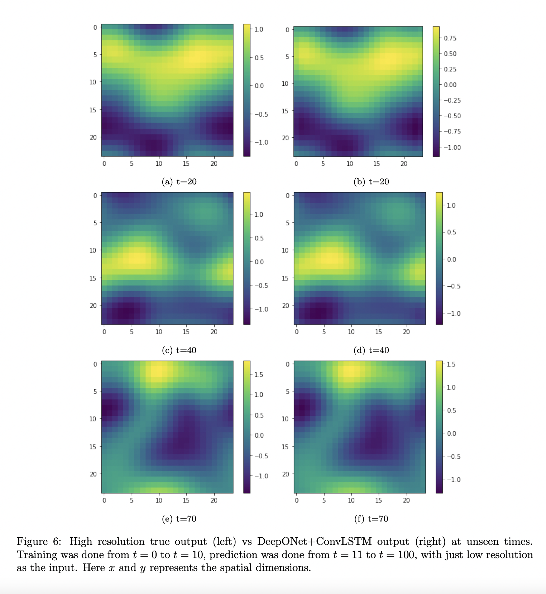
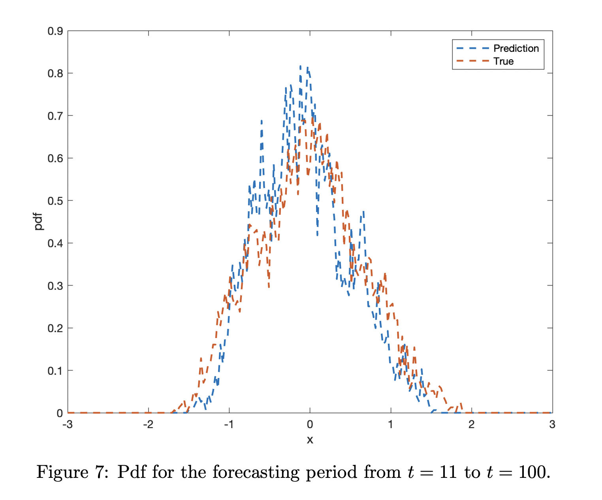
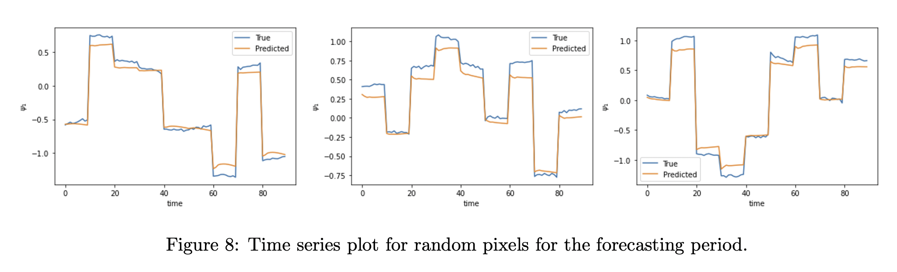

DeepONet based online climate bias correction
=============================================

DeepONet
--------

Consider an operator :math:`\mathcal{G}`, that maps from the input function :math:`v` to the output function :math:`u`, i.e., :math:`\mathcal{G}: v \rightarrow u`. DeepONet tries to learn the operator :math:`\mathcal{G}` by approximating the basis function for expressing the output functional space.  The physics of the problem is enforced using the labelled input-output dataset pairs for the conventional architecture of the proposed operators.

Problem setup for beta model
----------------------------
	
The overarching goal of this study is to train a DeepONet aided neural operator to approximate a map from the :math:`\psi(\bar{x},\bar{y},t)` to :math:`\Psi(x,y,t)`, where :math:`\psi` and :math:`\Psi`   represent low and high resolution Quasi-Geostrophic (QG) flow fields in space. Therefore, our aim is to formulate a DeepONet \cite{lu2021learning} architecture to learn the operator mapping :math:`\mathcal{G}` from the functional space :math:`\psi` to the function space :math:`\Psi`, which is expressed as

.. math::
	\mathcal{G}: \psi(\bar{x},\bar{y},t) \xrightarrow[]{} \Psi(x,y,t).

To train the DeepONet based neural operator, we generated the data by solving the two layer QG system for a very long  time interval.

Using a variable-separation approach (in space-time), we postulate that the QG flow field can be expressed as

.. math::
	\psi = \phi(x, y)\zeta(t).

Motivated by the above equation, we construct a novel DeepONet architecture by pairing DeepONet with an LSTM architecture in a single framework in the following manner:

1. The first step is to train a DeepONet to approximate the operator  :math:`\mathcal{G}` in space by mapping the low resolution data  :math:`\psi(\bar{x},\bar{y},t)`   :math:`{\in \mathbb{R}^{24 \times 24}}` to high resolution data  :math:`\Psi(x,y,t)`  :math:`{\in \mathbb{R}^{24 \times 24} \approx \mathcal{P}\left( \mathbb{R}^{128 \times 128}\right)}`, where  :math:`\mathcal{P}` is high order and numerically constructed projection operator. In other words,  we want to approximate  :math:`\phi(x, y)` using a DeepONet. 

2. The second step is to use the high resolution output approximated by DeepONet and incorporate the memory of system by using a Long short-term memory (LSTM) network, which is approximating  :math:`\zeta(t)` using a sequence-to-sequence mapping.  However, the solution of QG system lies in a high dimensional space  :math:`(\mathbb{R}^{24\times24})` space, which is also the dimension of the feature space for training and testing of LSTM, resulting in a computationally taxing process for the training of LSTM. To circumvent this issue instead of vanilla LSTM, we use a 2D Convolutional LSTM, which replaces the binary operation in vanilla LSTM with convolution. 

Results for beta model
----------------------

The figure below shows the prediction of the pdfs of streamfunctions :math:`\psi_1` and :math:`\psi_2`, and the amplitude of wavenumbers :math:`(1,0), (1,1)` of the barotropic streamfunction for :math:`\beta = 2` and :math:`r = 0.2`, while training took place for :math:`\beta = 2` and :math:`r = 0.1`.

The objective of this task is to correct the statistics in space and time by utilizing the the low resolution data for a prescribed measurable and forecast in time. 

  

Problem Setup for E3SM
----------------------

.. figure:: images/fig_1.png
  :width: 600
  :align: center
  :alt: Alternative text

The main idea is to use a DeepONet to replace the nudging mechanism for the online bias correction for the state variables *U* and *V*.

.. figure:: images/fig_2.png
  :width: 600
  :align: center
  :alt: Alternative text

DeepONet Setup
--------------

The overall process can be divided into three parts:

1. Encode X~bf *(X: state variable, bf: before nudging)*
2. Predict Nudging tendency X~ndg  *(ndg: nudging tendency)* for X~bf in the encoded domain.
3. Decode the X~ndg  to the nudging tendency X~ndg in the original domain.

The over all architecture is shown in the figure below.

.. figure:: images/fig_3.png
  :width: 600
  :align: center
  :alt: Alternative text

Data
----

*State variables* : *U* (East-West wind component) , *V* (North-South wind component)

*Dimension* *(Nz, Nt, Nx, Ny)*, 

where *Nz=72, Nt=248, Nx=70, Ny=70*

For the current test case, we select the folowing patch for the DeepONet training

.. figure:: images/fig_4.png
  :width: 600
  :align: center
  :alt: Alternative text

Code Setup
----------
 
1. Encoder Decoder output
	
	To see the encoder decoder outputs for a particular Field Variable:
			
			* open the job_sbatch file.
			
			* Enter the datapath in which the data is in  DATAPATH=''. For example if you have the data in the path '/Users/abora/NEW_AE_DATA/', then enter DATAPATH='/Users/abora/NEW_AE_DATA/'.
			
			* We have three kinds of data in three different folders
						* 	 'NDG_TEND/' : for the nudging tendency data
						*    'BF_NDG/': for the before nudged data
						*    'REF/' : for the reference data
			    Based on whichver data we want type the folder name in FOLDER_NAME=''. For example if we want the data for nudging tendency enter FOLDER_NAME='NDG_TEND/'.
			    
			* Enter the state variable name in the FIELD="" . For example if you want to see the results for U type FIELD="U".
			
			* Enter the time for which you want to see the plots in PLOT_TIME= . For example you want to see the plot for t=100, then enter PLOT_TIME=100.
			
			* Make an empty folder Figs in same directy as where the code is to save all the figures. 
			
			* Now type sbatch job.sbatch in your terminal.

For the implementation and code click [`here <https://github.com/raj-brown/darpa_climate_code>`_]

Results
-------

For the results of the DeepONet click [`here <https://drive.google.com/drive/folders/1rmrz2I5v8Mi5MB3nR90Ny-FyzvdVzx7r?usp=sharing>`_]. This link shows the simulation of the hurricane Sandy in 2012. The results show that the DeepONet can learn the corrective tendency very well and can reproduce the hurrican Sandy.

In this [`link <https://drive.google.com/drive/folders/1POGC_GHiZbbVZr2qUorqqn9YIclDyvQm?usp=sharing>`_] you can find the simulation of the nudging tendedncy and its correlation with the nudging tendency used in E3SM.

Online integration
------------------

