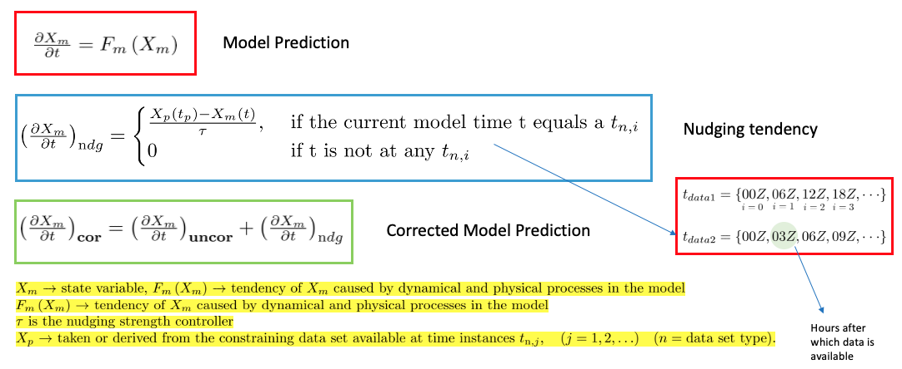

DeepONet based online climate bias correction
=============================================

DeepONet
--------

Consider an operator :math:`\mathcal{G}`, that maps from the input function :math:`v` to the output function :math:`u`, i.e., :math:`\mathcal{G}: v \rightarrow u`. DeepONet tries to learn the operator :math:`\mathcal{G}` by approximating the basis function for expressing the output functional space.  The physics of the problem is enforced using the labelled input-output dataset pairs for the conventional architecture of the proposed operators.

Beta Model
----------

The overarching goal of this study is to train a DeepONet aided neural operator to approximate a map from the :math:`\psi(\bar{x},\bar{y},t)` to :math:`\Psi(x,y,t)`, where :math:`\psi` and :math:`\Psi`   represent low and high resolution Quasi-Geostrophic (QG) flow fields in space. Therefore, our aim is to formulate a DeepONet \cite{lu2021learning} architecture to learn the operator mapping :math:`\mathcal{G}` from the functional space :math:`\psi` to the function space :math:`\Psi`, which is expressed as
.. math::
	\begin{equation*}
	    \mathcal{G}: \psi(\bar{x},\bar{y},t) \xrightarrow[]{} \Psi(x,y,t).
	\end{equation*}

To train the DeepONet based neural operator, we generated the data by solving the two layer QG system for a very long  time interval.

Problem Setup
-------------

The main idea is to use a DeepONet to replace the nudging mechanism for the online bias correction for the state variables *U* and *V*.

.. figure:: images/fig_2.png
  :width: 600
  :align: center
  :alt: Alternative text

DeepONet Setup
--------------

The overall process can be divided into three parts:

1. Encode X~bf *(X: state variable, bf: before nudging)*
2. Predict Nudging tendency X~ndg  *(ndg: nudging tendency)* for X~bf in the encoded domain.
3. Decode the X~ndg  to the nudging tendency X~ndg in the original domain.

The over all architecture is shown in the figure below.

.. figure:: images/fig_3.png
  :width: 600
  :align: center
  :alt: Alternative text

Data
----

*State variables* : *U* (East-West wind component) , *V* (North-South wind component)

*Dimension* *(Nz, Nt, Nx, Ny)*, 

where *Nz=72, Nt=248, Nx=70, Ny=70*

For the current test case, we select the folowing patch for the DeepONet training

.. figure:: images/fig_4.png
  :width: 600
  :align: center
  :alt: Alternative text

Code Setup
----------
 
1. Encoder Decoder output
	
	To see the encoder decoder outputs for a particular Field Variable:
			
			* open the job_sbatch file.
			
			* Enter the datapath in which the data is in  DATAPATH=''. For example if you have the data in the path '/Users/abora/NEW_AE_DATA/', then enter DATAPATH='/Users/abora/NEW_AE_DATA/'.
			
			* We have three kinds of data in three different folders
						* 	 'NDG_TEND/' : for the nudging tendency data
						*    'BF_NDG/': for the before nudged data
						*    'REF/' : for the reference data
			    Based on whichver data we want type the folder name in FOLDER_NAME=''. For example if we want the data for nudging tendency enter FOLDER_NAME='NDG_TEND/'.
			    
			* Enter the state variable name in the FIELD="" . For example if you want to see the results for U type FIELD="U".
			
			* Enter the time for which you want to see the plots in PLOT_TIME= . For example you want to see the plot for t=100, then enter PLOT_TIME=100.
			
			* Make an empty folder Figs in same directy as where the code is to save all the figures. 
			
			* Now type sbatch job.sbatch in your terminal.

For the implementation and code click [`here <https://github.com/raj-brown/darpa_climate_code>`_]

Results
-------

For the results of the DeepONet click [`here <https://drive.google.com/drive/folders/1rmrz2I5v8Mi5MB3nR90Ny-FyzvdVzx7r?usp=sharing>`_]

