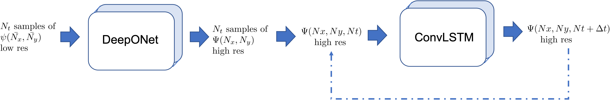
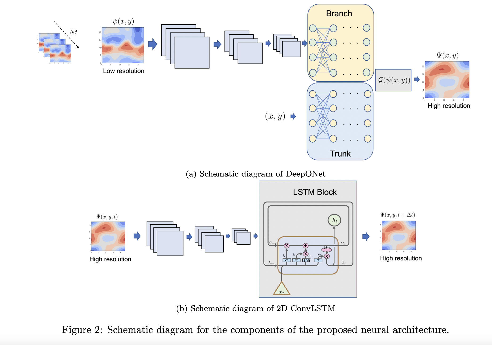
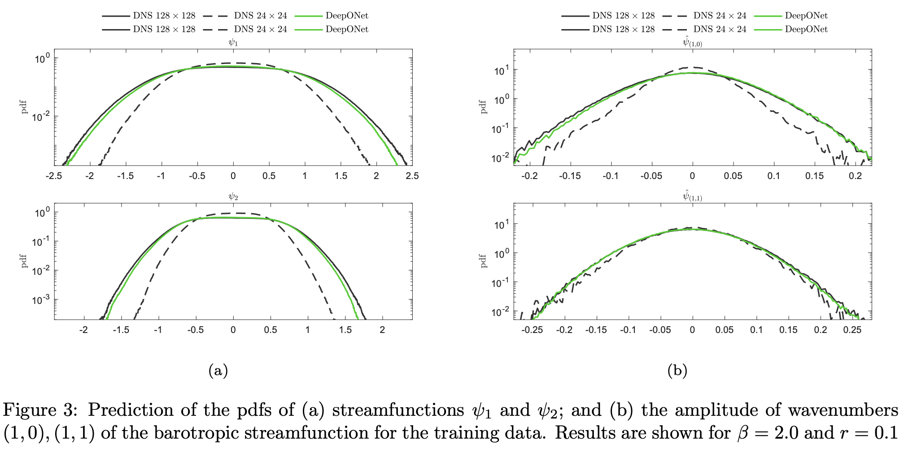
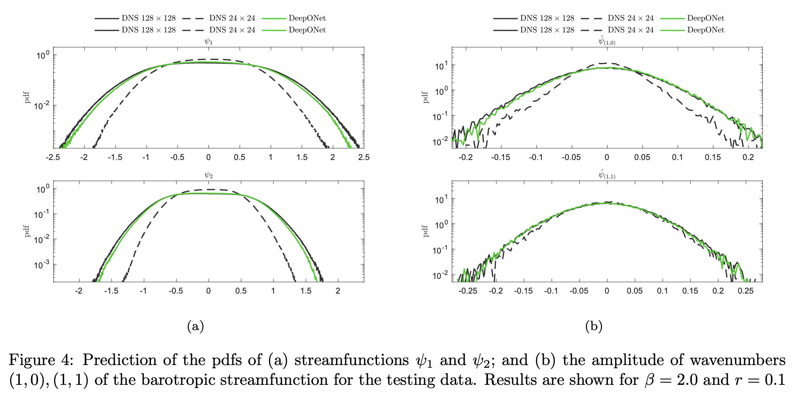
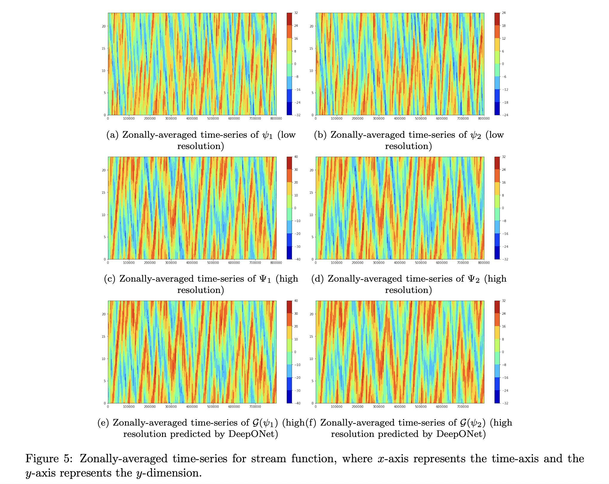
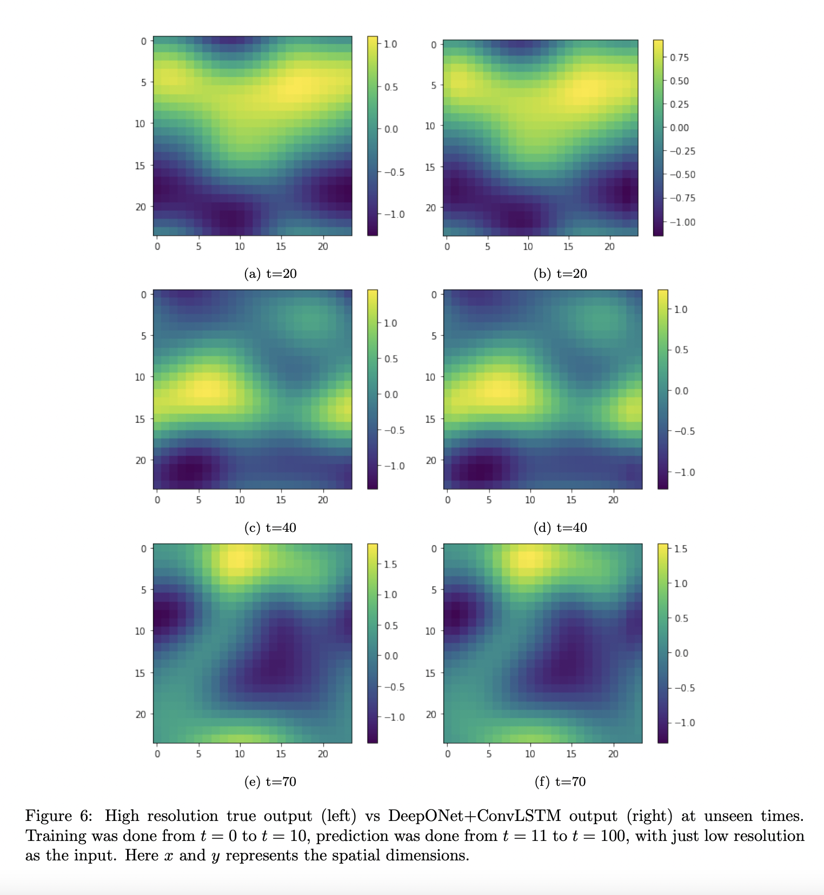
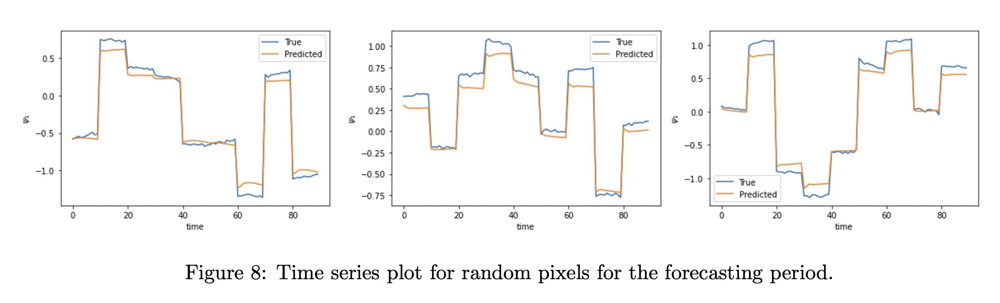

DeepONet for QG Model
=====================

Problem setup for beta model
----------------------------
	
The overarching goal of this study is to train a DeepONet aided neural operator to approximate a map from the :math:`\psi(\bar{x},\bar{y},t)` to :math:`\Psi(x,y,t)`, where :math:`\psi` and :math:`\Psi`   represent low and high resolution Quasi-Geostrophic (QG) flow fields in space. Therefore, our aim is to formulate a DeepONet \cite{lu2021learning} architecture to learn the operator mapping :math:`\mathcal{G}` from the functional space :math:`\psi` to the function space :math:`\Psi`, which is expressed as

.. math::
	\mathcal{G}: \psi(\bar{x},\bar{y},t) \xrightarrow[]{} \Psi(x,y,t).

To train the DeepONet based neural operator, we generated the data by solving the two layer QG system for a very long  time interval.

Using a variable-separation approach (in space-time), we postulate that the QG flow field can be expressed as

.. math::
	\psi = \phi(x, y)\zeta(t).

Motivated by the above equation, we construct a novel DeepONet architecture by pairing DeepONet with an LSTM architecture in a single framework in the following manner:

1. The first step is to train a DeepONet to approximate the operator  :math:`\mathcal{G}` in space by mapping the low resolution data  :math:`\psi(\bar{x},\bar{y},t)`   :math:`{\in \mathbb{R}^{24 \times 24}}` to high resolution data  :math:`\Psi(x,y,t)`  :math:`{\in \mathbb{R}^{24 \times 24} \approx \mathcal{P}\left( \mathbb{R}^{128 \times 128}\right)}`, where  :math:`\mathcal{P}` is high order and numerically constructed projection operator. In other words,  we want to approximate  :math:`\phi(x, y)` using a DeepONet. 

2. The second step is to use the high resolution output approximated by DeepONet and incorporate the memory of system by using a Long short-term memory (LSTM) network, which is approximating  :math:`\zeta(t)` using a sequence-to-sequence mapping.  However, the solution of QG system lies in a high dimensional space  :math:`(\mathbb{R}^{24\times24})` space, which is also the dimension of the feature space for training and testing of LSTM, resulting in a computationally taxing process for the training of LSTM. To circumvent this issue instead of vanilla LSTM, we use a 2D Convolutional LSTM, which replaces the binary operation in vanilla LSTM with convolution. 

Results for beta model
----------------------

The figure below shows the prediction of the pdfs of streamfunctions :math:`\psi_1` and :math:`\psi_2`, and the amplitude of wavenumbers :math:`(1,0), (1,1)` of the barotropic streamfunction for :math:`\beta = 2` and :math:`r = 0.2`, while training took place for :math:`\beta = 2` and :math:`r = 0.1`.

The objective of this task is to correct the statistics in space and time by utilizing the the low resolution data for a prescribed measurable and forecast in time. 

.. figure:: images/lstm_1.png
  :width: 300
  :align: center
  :alt: Alternative text
  

