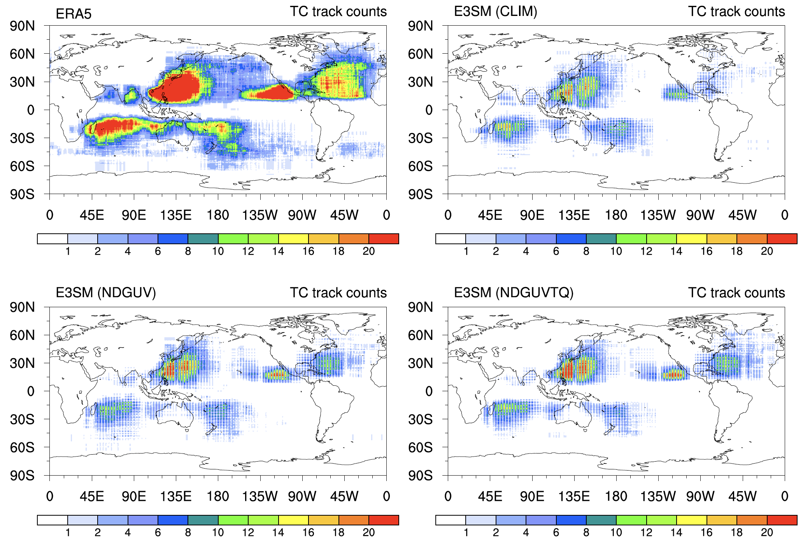
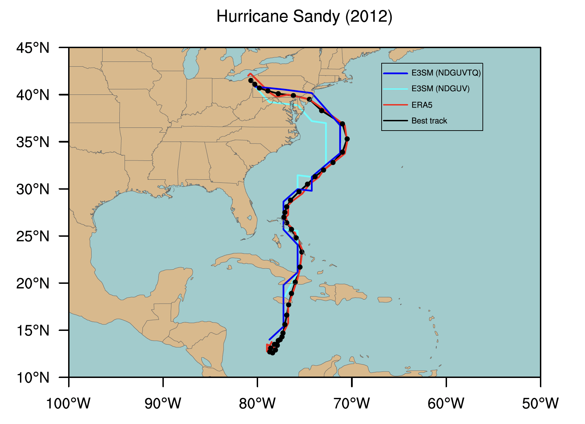
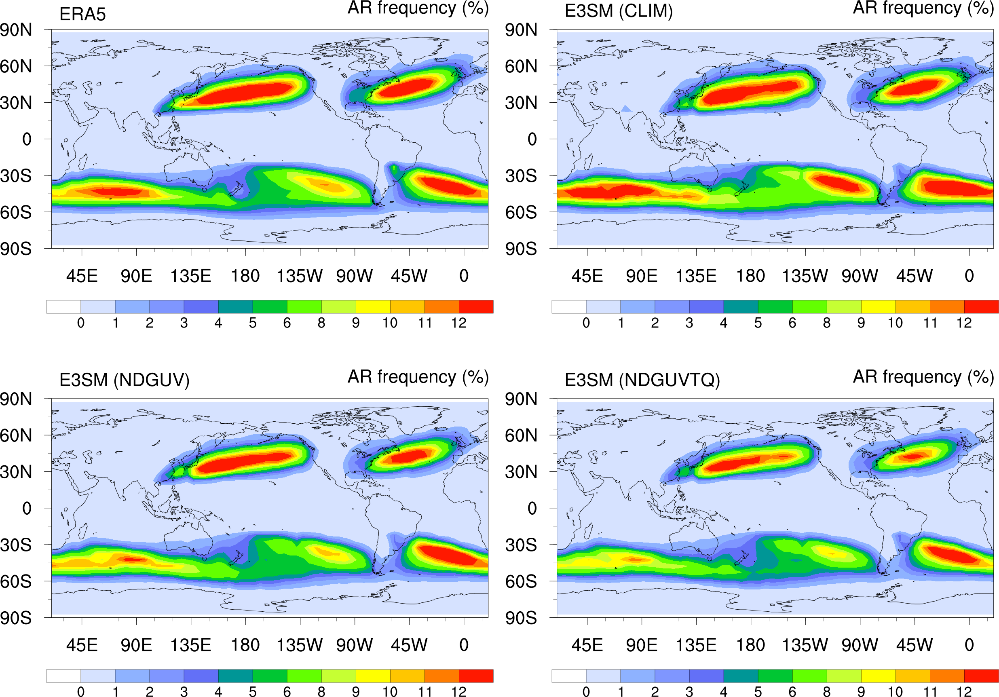
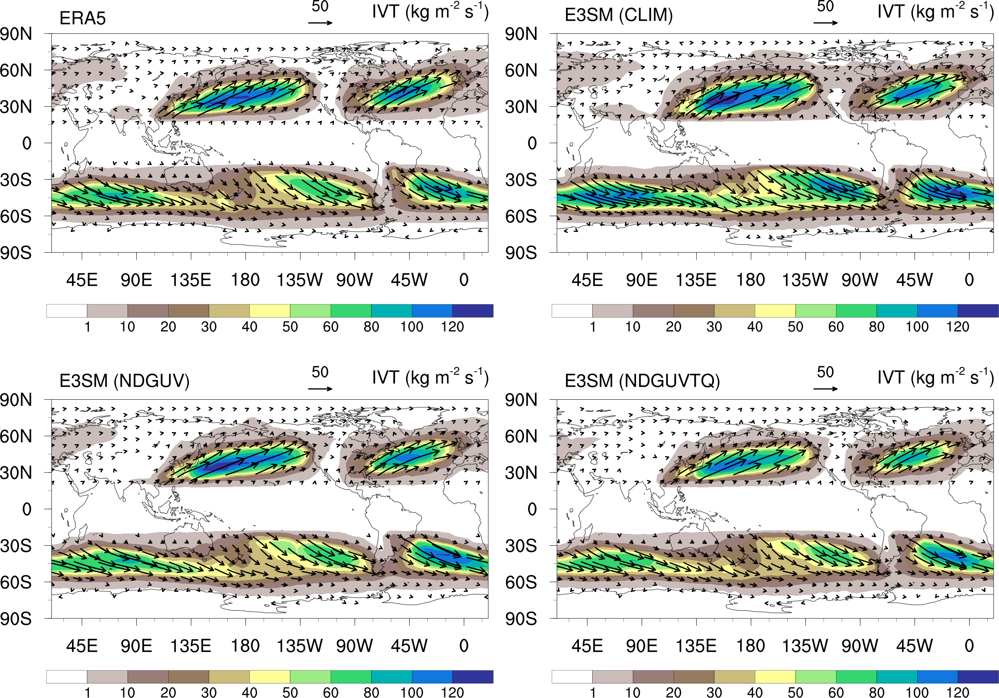
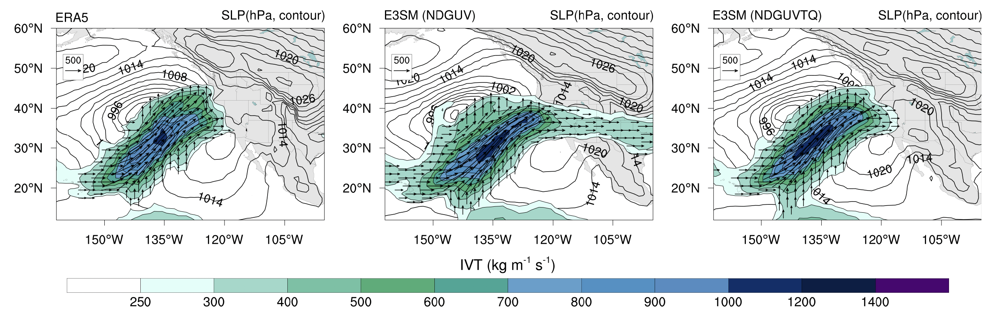

Extreme Events
==============

To demonstrate that the ML-corrections trained on the nudging datasets are capable of capturing extreme weather events in the coarse-scale EAMv2 model, we show three examples: tropical cyclones (TCs), extratropical cyclones (ETCs), and atmospheric rivers (ARs).

Tropical Cyclones (TCs)
-----------------------
A tropical cyclone (TC) is defined as a cyclonic structure with a distinct warm core. Figure 1 shows the TC track density maps from the ERA5 reanalysis (reference data), EAM free-running simulations (CLIM), and two nudged EAM simulations. The results are generated by `TempestExtremes <https://climate.ucdavis.edu/tempestextremes.php>`_, a software package developed for the analysis of extreme weather event (`Ullrich et al. 2021 <https://gmd.copernicus.org/articles/14/5023/2021/>`_). The TC track density is defined as the total number of 6-hourly TCs occurrences per :math:`1^{o} \times 1^{o}` grid box. There exists a significant mismatch in the density of TCs between ERA5 (Fig. 1a) and CLIM (Fig. 1b) in the northeast Pacific and north Atlantic ocean regions. This mismatch is significantly reduced when EAM is nudged towards the ERA5 reanalysis (Fig. 1c--d).

  Figure 1. Track density maps for tropical cyclones (TCs) tracked in ERA5 reanalysis (top left panel), EAM free-running (CLIM, top right panel), an EAM simulation nudged towards wind fields from ERA5 reanalysis (NDGUV, bottom left panel), and an EAM simulation nudged towards wind, temperature, and humidity fields from ERA5 reanalysis (NDGUVTQ, bottom right panel) during the period of 2007--2017. Units are number of 6-hourly TCs occurrences per :math:`1^{o} \times 1^{o}` grid box. The resolution for ERA5 reanalysis is :math:`0.25^{o} \times 0.25^{o}`, while the resolution for all EAM simulations is :math:`1^{o} \times 1^{o}` in horizontal. 

Figure 2 shows the individual TC trajectories within the northeast Pacific and north Atlantic ocean regions, including the total count in each subpanel. It is clear that the nudged simulations produce twice as many TCs than CLIM. Moreover, because the nudged simulations are guided by observed wind patterns, they can reproduce real-world events such as Hurricane Sandy (black dot line) which hit the United States in 2012.  Free-running versions of EAM, such as CLIM, are not expected to reproduce real-world extremes and only their statistics can be compared. 

  Figure 2. Tropical cyclone trajectories within [0-70N, 10-160W] during the period of 2007--2017 from ERA5 reanalysis (top left panel), EAM free-running (CLIM, top right panel), an EAM simulation nudged towards wind fields from ERA5 reanalysis (NDGUV, bottom left panel), and an EAM simulation nudged towards wind, temperature, and humidity fields from ERA5 reanalysis (NDGUVTQ, bottom right panel). TempestExtremes is used to track TCs in each simulation. Coloring denotes the instantaneous `Saffir–Simpson <https://www.nhc.noaa.gov/aboutsshws.php>`_ category of the tropical cyclone. The categories are computed from sea level pressure and applying the pressure--wind relationship (`Atkinson and Holliday, 1977 <https://journals.ametsoc.org/view/journals/mwre/105/4/1520-0493_1977_105_0421_tcmslp_2_0_co_2.xml>`_, `Knaff and Zehr, 2007 <https://journals.ametsoc.org/view/journals/wefo/22/1/waf965_1.xml>`_). The black dots indicate the track of Hurricane Sandy that made landfall over the United States in 2012. The resolution for ERA5 reanalysis is :math:`0.25^{o} \times 0.25^{o}`, while the resolution for all EAM simulations is :math:`1^{o} \times 1^{o}` in horizontal. 

Figure 3 further shows the track of Hurricane Sandy from the observations, ERA5 reanalysis, and two nudged EAM simulations. Again, EAM simulates the track of Hurricane Sandy reasonably well when winds are nudged toward reanalysis data. The improvements are even larger when the temperature and humidity are nudged as well.  See  [`animation <https://portal.nersc.gov/cfs/e3sm/zhan391/darpa_temporary_data_share/post_processing/storm/TempestExtremes/figure/TCS/sandy/animate_sandy.gif>`_] for the development of Hurricane Sandy from 1800 UTC 21 to 1200 UTC 31 October 2012 in the ERA5 reanalysis and nudged EAM simulations. 

  

  Figure 3. Tropical cyclone trajectories for hurricane Sandy from 1800 UTC 21 to 1200 UTC 31 October 2012 from observations (best track, black dots), ERA5 reanalysis (reference, red line), EAM simulations nudged towards wind fields from ERA5 reanalysis (NDGUV, cyan line), and EAM simulations nudged towards wind, temperature, and humidity fields from ERA5 reanalysis (NDGUVTQ, blue line). Note that nudging wind and temperature (i.e. NDGUVT) produces similar results as in NDGUVTQ.  Sandy first appeared as a TC on 1200 UTC 22 October, 1800 UTC 23 October and 1200 UTC 24 October in the ERA5 analysis, NDGUV and NDGUVTQ, respectively. 

Extratropical Cyclones (ETCs)
-----------------------------

An extratropical cyclone (ETC) is defined as a cyclonic structure with no distinct warm core. Figure 4 shows the ETC track density maps from ERA5 reanalysis (reference data), an EAM free-running simulation (CLIM), and two nudged EAM simulations (NDGUV and NDGUVTQ). The results are generated by TempestExtremes, and the ETC track density represents the total number of 6-hourly ETC occurrences per :math:`5^{o} \times 5^{o}` grid box. Like for TCs, free-running EAM underestimates ETC frequency. Again, like for TCs, nudging improves the overall statistics of ETCs over the Northern hemisphere storm track regions. 

.. figure:: Data_figs/Track_density_2.png
  :width: 800
  :align: center
  :alt: Alternative text

Figure 4. Track density maps for extratropical cyclones (ETCs) tracked in ERA5 reanalysis (top left panel), EAM free-running (CLIM, top right panel),  EAM simulations nudged towards wind fields from ERA5 reanalysis (NDGUV, bottom left panel), and EAM simulations nudged towards wind, temperature, and humidity fields from ERA5 reanalysis (NDGUVTQ, bottom right panel) during the period of 2007--2017. Units are number of 6-hourly TCs occurrences per :math:`5^{o} \times 5^{o}` grid box. The resolution for ERA5 reanalysis is :math:`0.25^{o} \times 0.25^{o}`, while the resolution for all EAM simulations is :math:`1^{o} \times 1^{o}` in horizontal. 

An ETC produced heavy snowfall across the Northeast U.S. during 22-24 January 2016.  Figure 5 shows the horizontal distribution of 850-hPa winds (m/s, vector) and mean sea level pressure (hPa, shading) at 12Z, 23 January 2016. The horizontal distribution of ETC winds and pressure are captured reasonably well in the nudged EAM simulations. See [`animation <https://portal.nersc.gov/cfs/e3sm/zhan391/darpa_temporary_data_share/post_processing/storm/TempestExtremes/figure/ETCS/case/animate_etc_trk_2016.gif>`_] for the development of the ETC from 0000 UTC 21 to 1800 UTC 24 January.

  Figure 5. Horizontal distribution of 850-hPa wind (m s math:`^{-1}`, vector) and mean sea level pressure (hPa, shading) at 12Z, 23 January 2016 from (left panel) ERA5 reanalysis, (middle panel) EAM simulations nudged towards wind fields from ERA5 reanalysis and (right panel) EAM simulations nudged towards wind, temperature, and humidity fields from ERA5 reanalysis.The black dots denotes the track of the ETC from 12Z 22 to 12 Z 23 January 2016. The reanalysis and EAM simulations are regrided to the same :math:`1^{o} \times 1^{o}` grid box in horizonal for comparison.   

Atmospheric rivers (ARs)
------------------------

An atmospheric rivers (AR) is a thin and long filamentary structure characterized by high integrated vapor transport `(Payne et al., 2020) <https://www.nature.com/articles/s43017-020-0030-5>`_. Figure 5 shows the AR frequency maps from ERA5 reanalysis (reference data), an EAM free-running simulation (CLIM), and two nudged EAM simulations (NDGUV and NDGUVTQ). Following Kim et al. `(2020) <https://doi.org/10.5194/gmd-15-5461-2022>`_, the AR frequency represents the number of time steps the grid cell was part of AR divided by the total number of time steps in the time period. The AR frequency are averated over a :math:`5^{o} \times 5^{o}` grid box to facillitate a comparision of high-resolution ERA5 reanalysis and low-resolution EAM simulations.  The detection algorithm in TempestExtremes is applied to identify AR. We can see that the distribution of the annual frequency of ARs in E3SM closely matches EAR5's distribution as seen in top two panels of Fig. 5 except that the E3SM tends to overestimate the occurance of the ARs espacially over the Souther Hemisphere storm track regions. Again, nudging (bottom two panels) improves the agreements of overall statistics of AR requency over the Southern hemisphere storm track regions with the ERA5. 

  
Figure 5. Global distribution of mean annual AR frequency (%) over the period of 2007-2017 from ERA5 reanalysis (top left panel), EAM free-running (CLIM, top right panel),  EAM simulations nudged towards wind fields from ERA5 reanalysis (NDGUV, bottom left panel), and EAM simulations nudged towards wind, temperature, and humidity fields from ERA5 reanalysis (NDGUVTQ, bottom right panel). Units are mean AR frequency over a :math:`5^{o} \times 5^{o}` grid box. For each grid cell, the frequency shown represents the number of time steps the grid cell was part of AR divided by the total number of time steps in the time period. The frequency is calculated for each year from 2007 to 2017, then averaged over the whole 11-year period. The detection algorithm in TempestExtremes was applied to identify ARs in ERA5 reanalysis and EAM simulations.  

Figure 6 further shows the annual mean water vapor transport associated with AR. Consistent with the results in Figure 5, there is an overestimation of AR-associated water vapor transport in EAM free-running simulation compared to ERA5 reanalysis (reference). In contrast, nudging improves the agreement of the AR-associated water vapor transport in EAM simulations with the ERA5 reanalysis. 

  
Figure 6. Global distribution of annual mean vertically integrated water vapor transport (IVT, shading, kg m s :math:`^{-2}`) associated with ARs over the period of 2007-2017 from ERA5 reanalysis (top left panel), EAM free-running (CLIM, top right panel),  EAM simulations nudged towards wind fields from ERA5 reanalysis (NDGUV, bottom left panel), and EAM simulations nudged towards wind, temperature, and humidity fields from ERA5 reanalysis (NDGUVTQ, bottom right panel). The IVT in ERA5 reanalysis and EAM simulations are averaged over a :math:`5^{o} \times 5^{o}` grid box for comparision. The algorithm in TempestExtremes was applied to identify IVT associated with ARs in ERA5 reanalysis and EAM simulations. The vectors in each panel represents the meridional and zonal components of IVT.   

The AR event that occurred during February 07--11 2017 caused problems for the Oroville Dam. Figures 6 and 7 show the distribution of the vertically integrated water vapor transport (IVT), and the vertically integrated water vapor (IWV), respectively at 12Z on 08 February 2017. The development of the AR in the nudged EAM simulations agrees reasonably well with the ERA5 reanalysis, owing to the constraints on the large-scale circulation by nudging. The development of the AR during February 07--11 2017 in the ERA5 reanalysis and the nudged EAM simulations are featured in [`animation 1 <https://portal.nersc.gov/cfs/e3sm/zhan391/darpa_temporary_data_share/post_processing/storm/TempestExtremes/figure/ARs/case/animate_ivt_201702.gif>`_] 
and  [`animation 2 <https://portal.nersc.gov/cfs/e3sm/zhan391/darpa_temporary_data_share/post_processing/storm/TempestExtremes/figure/ARs/case/animate_iwv_201702.gif>`_]

  Figure 6. Vertically integrated water vapor transport (IVT, kg m s :math:`^{-2}`) and  mean sea level pressure (contour, hPa)  at 12Z 08 February 2017 from ERA5 reanalysis (left panel), EAM simulations nudged towards wind fields from ERA5 reanalysis (NDGUV, middle panel), and EAM simulations nudged towards wind, temperature, and humidity fields from ERA5 reanalysis (NDGUVTQ, right panel). The vectors are derived from the eastward and northward components of water vapor transport. The reanalysis and EAM simulations are regrided to the same :math:`1^{o} \times 1^{o}` grid box in horizonal for comparison. 

.. figure:: Data_figs/water.png
  :width: 1000
  :align: center
  :alt: Alternative text

  Figure 7. Vertically integrated water vapor (shading, kg m s :math:`^{-2}`), 850-hPa wind fields (vector, m/s) and mean sea level pressure (contour, hPa) at 12Z 08 February 2017 from from ERA5 reanalysis (left panel), EAM simulations nudged towards wind fields from ERA5 reanalysis (NDGUV, middle panel), and EAM simulations nudged towards wind, temperature, and humidity fields from ERA5 reanalysis (NDGUVTQ, right panel). The contours denote the sea level pressure (PSL) in units of hPa. The reanalysis and EAM simulations are regrided to the same :math:`1^{o} \times 1^{o}` grid box in horizonal for comparison. 

