Non-intrusive LSTM architecture
===============================
Problem Setup
-------------

This work aims to train a neural network that, given as input the predictions of a free running coarse-
scale simulation, denoted as CLIM in this project, :math:`\left(U, V, Q, T\right)^{\text{CLIM}}`, it will produce a modified time-series :math:`\left(U, V, Q, T\right)^{\text{ML}}` that will have the same
statistics as a fine-scale reference simulation :math:`\left(U, V, Q, T\right)^{\text{ERA5}}`. For this
project, reference data correspond to ERA5 reanalysis datasets while free running coarse-scale
simulations are generated via the E3SM CLIM model. A diagram of this process is the figure below. The
de-coupling of the data-informed correction process and the initial simulation phase is justified by the
fact that the goal is not to make phase corrections at each time-step but retrieve the correct statistics
for the current flow parameters.

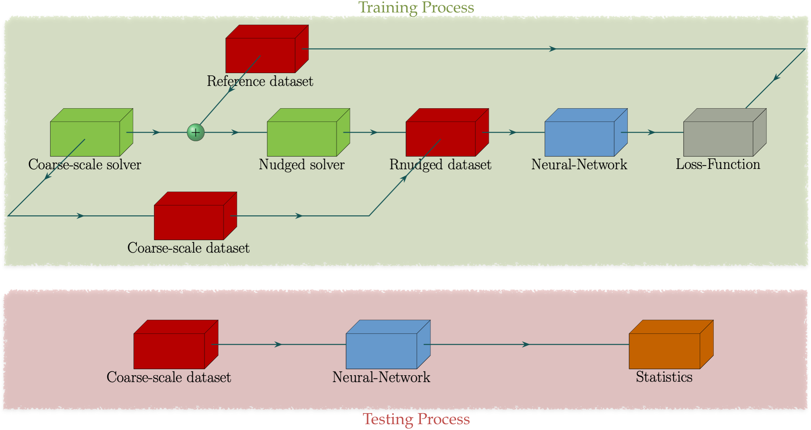

While testing will be carried out using free running coarse-scale data, appropriate training data need to
be determined first. Due to chaotic divergence, free running coarse-scale data will very quickly diverge
from their fine-scale conuterpart despite having the same flow parameters and initial conditions. As a
result, it is not feasible for a neural network to learn a generalizable mapping directly between
:math:`\left(U, V, Q, T\right)^{\text{CLIM}}` and :math:`\left(U, V, Q, T\right)^{\text{ERA5}}`. To
that end, to produce coarse-scale simulations for training, a relaxation term :math:`Q` is added to the
evolution equations of the prognostic variables :math:`\left(U, V, Q, T\right)`. The term :math:`Q` is called nudging tendency
and it corrects the coarse-scale solution based on the fine-scale reference solution. In this study, for a
variable :math:`X`, the nudging tendency :math:`Q` is given by the algebraic term

:math:`Q\left( X-X^{\text{ERA5}} \right) = -\frac{1}{\tau} \left( X-\mathcal{H} \left[X^{\text{ERA5}}\right] \right).`

Parameter :math:`\tau` is a relaxation timescale to be determined, and :math:`\mathcal{H}` is an operator
that maps :math:`X^{\text{ERA5}}` to the coarse resolution.

Model Architecture
------------------

In the current implementation, training is done on a layer-by-layer basis. A schematic of the configuration for training on a particular layer is shown below. The model receives as input the predictive variables :math:`\mathbf{X}=\mathbf{X}(\phi,\theta,t;k)`. The input receives snapshots of the entire horizontal discretization of the layer. Afterwards, a custom "split" layer separates the inputs into non-overlapping subregions. These subregions are periodically padded via a custom padding process, tasked with respecting the spherical periodicity of the domain. Then, each subregion is independently passed through a series of convolutional layers. The purpose of this process is to extract local features in each subregion, given the anisotropic nature of the flow. This process is vital in order to extract features that pertain to extreme events like cyclones and atmospheric rivers.

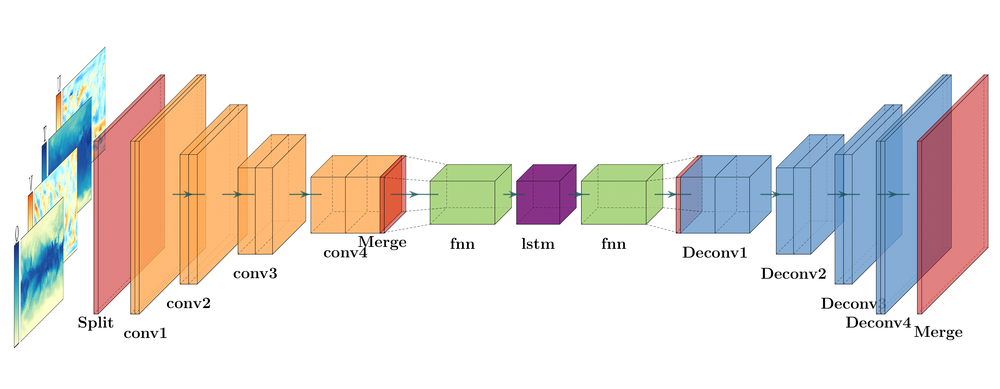

Afterwards, the local information extracted from each subregion is concatenated in a single vector via a custom "merge" layer. The global information is now passed through a linear fully-connected layer, that acts as a basis projection of the spatial data onto a reduced-order latent space. The latent space data are then corrected by the LSTM layer and subsequently projected back to physical space via another fully-connected layer. LSTM neural networks incorporate (non-Markovian) memory effects into the reduced-order model. This ability stems from Takens embedding theorem. The theorem states that given delayed embeddings of a limited number of state variables, one can still obtain the attractor of the full system for the observed variables. This approach is known to be capable of improving predictions of reduced-order models. Hence, it is expected that RNNs can help predict the contribution of unresolved scales.

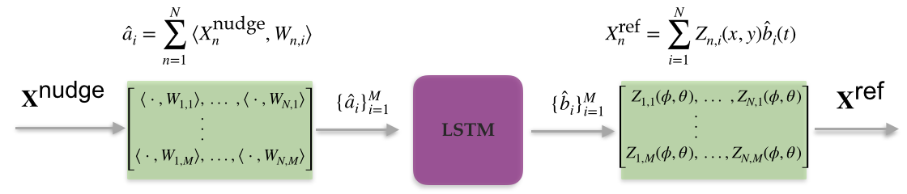

Afterwards, the local information extracted from each subregion is concatenated in a single vector via a custom "merge" layer. The global information is now passed through a linear fully-connected layer, that acts as a basis projection of the spatial data onto a reduced-order latent space. The latent space data are then corrected by the LSTM layer and subsequently projected back to physical space via another fully-connected layer. In the next step, global information is split into the same subregions of the input, and distributed to a series of independent deconvolution layers that upscale the data to the original resolution. Finally, a custom "merge" layer gathers the information from each subregion and produces the final corrected snapshot. 

Data Preparation
----------------

1. Lessons from beta-testing

This approach was first applied to a simpler, 2-layer quasi-geostrophic model. While using nudged data, one can hope that by using small :math:`\tau` they can get nudged dataset with the statistical properties of the free-running coarse-scale simulation but much lower phases errors with respect to the reference solution. However, as can be seen from the figure below, this is not possible. In fact, nudging can make the statistical properties of predictions worse than that of a free-running coarse simulation. Furthermore, even by hand-picking a value of :math:`\tau` so to match the statistics of the coarse simulation for one feature, the statistics will diverge for the others. This is a result
of discrepancies in the energy spectrum of the nudged solution with respect to the coarse-scale
solution.

.. figure:: images/Nudging_Choice.png
  :width: 600
  :align: center
  :alt: Alternative text
  
Similar behavior was observed on the E3SM dataset.
  
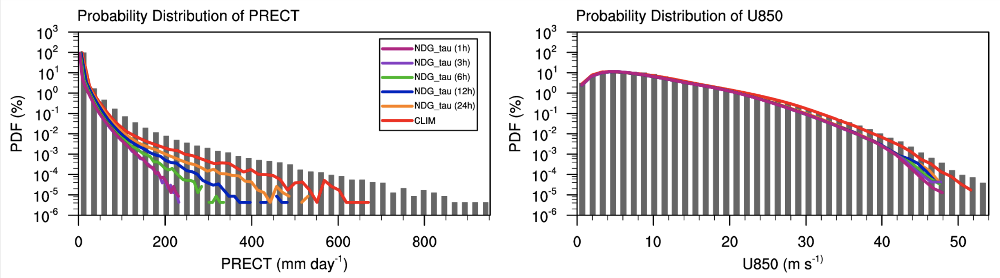

To remedy the energy spectra differences, a new method is developed and employed. The process is
called "Reverse Spectral Nudging" with its purpose being to match the energy spectrum of the nudged
solution to that of the coarse-scale solution to improve the training process. While traditional nudging schemes correct the coarse-scale solution with data from the reference solution, the proposed scheme further processes the nudged data by matching its energy spectrum to that of the
corresponding free running coarse-scale flow. The corrected nudged data is termed as :math:`\left( U,
V, Q, T \right)^{\text{R-Nudge}}` and defined, for a prognostic variable :math:`X`, as

:math:`X^{\text{RS-nudge}}\left(x, y t; z=z_0\right) = \sum_{k,l} R_{k,l} \hat{X}_{k,l}^{\text{nudge}}(t;z=z_0) e^{i\left( k x +l y \right)},`

where :math:`{X}_{k,l}^{\text{nudge}}(t)` are the spatial Fourier coefficients of :math:`X^{\text{nudge}}` and

:math:`R_{k,l} = \sqrt{\frac{\mathcal{E}^{\text{coarse}}_{k,l}}{\mathcal{E}^{\text{nudge}}_{k,l}}}, \quad\text{and} \quad \mathcal{E}_{k,l} = \frac{1}{T}\int_0^T \hat{E}_{k,l}(t) \mathrm{d}t =\frac{1}{T} \int_0^T|\hat{X}_{k,l}(t)|^2 \mathrm{d}t.`

The resulting dataset can be seen in the figure below.

.. figure:: images/Rnudged_Energy.png
  :width: 600
  :align: center
  :alt: Alternative text

This approach yielded improved results in the 2-layer QG model that were able to generalize outside the training set. In the figure below, best results obtained by training on nudged data (left column) for an ensemble of 10 neural networks are compared to training on R-nudged data (right column). Results are shown for flow parameters :math:`\beta = 2` (beta-plane approximation coefficient) and :math:'r = 0.1' (linear bottom-drag coefficient). In addition, the results for R-nudged data are computed using a time-interval of a flow that was not used during training. 

.. figure:: images/Rnudged_QG_Results.png
  :width: 600
  :align: center
  :alt: Alternative text

To further highlight the generalization capabilities of the scheme, the figure below is shown. Here, the LSTM was trained on flow data with parameters :math:`\beta = 2` and :math:'r = 0.1' but the results are shown for flow parameters :math:`\beta = 2` and :math:'r = 0.2'.

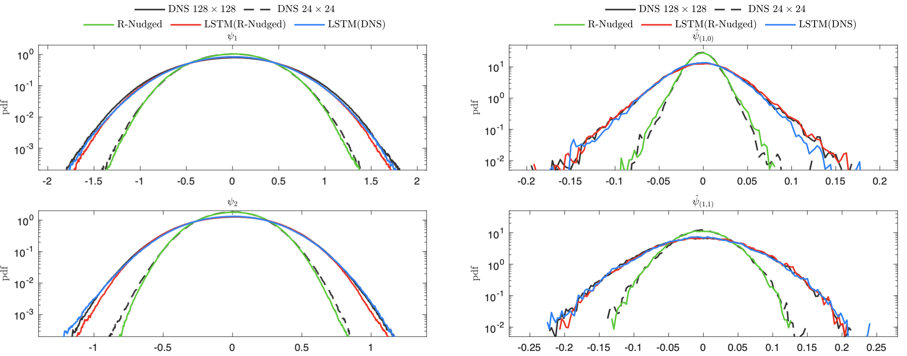

2, Application to climate datasets.

While traditional nudging schemes correct the coarse-scale solution with data from the reference solution, the proposed
scheme further processes the nudged data by matching its energy spectrum to that of the
corresponding free running coarse-scale flow. The corrected nudged data is termed as :math:`\left( U,
V, Q, T \right)^{\text{R-Nudge}}` and defined, for a prognostic variable :math:`X`, as

:math:`X^{\text{RS-nudge}}\left(x, y t; z=z_0\right) = \sum_{k,l} R_{k,l} \hat{X}_{k,l}^{\text{nudge}}(t;z=z_0) e^{i\left( k x +l y \right)},`

where :math:`{X}_{k,l}^{\text{nudge}}(t)` are the spatial Fourier coefficients of :math:`X^{\text{nudge}}` and

:math:`R_{k,l} = \sqrt{\frac{\mathcal{E}^{\text{CLIM}}_{k,l}}{\mathcal{E}^{\text{nudge}}_{k,l}}}, \quad\text{and} \quad \mathcal{E}_{k,l} = \frac{1}{T}\int_0^T \hat{E}_{k,l}(t) \mathrm{d}t =\frac{1}{T} \int_0^T|\hat{X}_{k,l}(t)|^2 \mathrm{d}t.`

A depiction of the values of these coefficients can be seen in the figure below.

.. figure:: images/E3SM_Rcoeff.png
  :width: 600
  :align: center
  :alt: Alternative text

An important property of this scheme is that the new data have exactly the energy spectrum of the free
running coarse simulation, meaning that the training and testing data come from the same distributions.
This property improves significantly the accuracy of the resulted ML scheme. The energy spectra of the
R-nudged solution indeed coincide with the coarse-scale free running spectra. In addition, the R-nudged data still follow the reference data, allowing for a mapping between :math:`\left( U,V,T,Q\right)^{\text{R-Nudge}}` and :math:`\left( U,V,T,Q \right)^{\text{ERA5}}`. This process does not
require running additional nudged simulations, thus lowering the total cost of the training scheme.

Value of Data Analysis
----------------------

The goal of this study is to identify optimal training datasets for predicting accurate statistics of extreme events for different climate free-runs. This is particularly important for this application as we have a vast set of data points and outputs, which if used inefficiently can lead to large wastes of computational time. It is also expected that different data-points will be crucial for different target extreme events. As a result, a number of different targets are described in the next subsection, and detailed results will be given in the future reports. For any form of value of data analysis, a method to estimate uncertainty in the predictions of the trained models is needed. To quantify uncertainty in the neural network predictions, an ensemble of neural networks, of size $N$, is employed. These neural networks are trained over the same dataset and have the same architecture and hyperparameters. The only difference between them is that the weights of each member of the ensemble are initialized with different values sampled from a random process. Using this ensemble, model uncertainty can be quantified via the variance

:math:`\sigma_{\epsilon}(\textbf{X}) = \sqrt{\sum_{n=1}^N  \frac{\left( Y_n(\textbf{X}) - \overline{Y}(\textbf{X})\right)^2}{N-1} }`

where :math:`\textbf{X}` corresponds to the input data and $Y$ is the quantity of interest. $Y_n$ is the prediction of the nth neural network of the ensemble, and 

:math:`\overline{Y}(\textbf{X}) = \frac{1}{N} \sum_{i=1}^N Y_n(\textbf{X})`

This metric can be used to assess the statistical characteristics of spatiotemporal local generalization errors as well as uncertainty in non-local quantities, such as PCA modes and global pdf predictions.

The iterative process for active sampling can be seen below. First, a small training set denoted by :math:`\Theta` is randomly selected. An ensemble of neural networks is trained over :math:`\Theta`. Then, the trained neural networks are used to predict the proposed acquisition function for a target quantity :math:`y`. The acquisition function is computed over the entire sampling dataset. Once the largest values of the acquisition function are found, the data points are added to the training set :math:`\Theta`. The number of data points added to the training set is a hyperparameter of the scheme. The neural networks are then trained over the new training set, with re-initialized weights. The process is repeated until satisfactory accuracy has been achieved. 

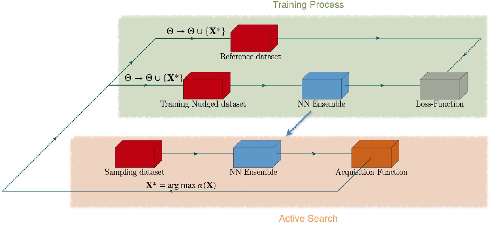

In the figure below, a comparison between Active Sampling and standard Monte Carlo sampling is shown. Results are shown for low-atmosphere temperature over North America. Mean-square error and Log-pdf error are used as metrics. With respect to the mean-square error, both methods appear to converge at the same rate. However, active sampling converges faster with the respect to the log-PDF error. These two results hint that the active sampling approach allows for faster sampling of extreme events in the behaviour of the dominant PCA mode. This behaviour will be evaluated on other quantities as well, to see its range of applicability. Of particular interest is the convergence properties for PCA modes of other physical quantities as well as indicators that are used as priors for extreme events.

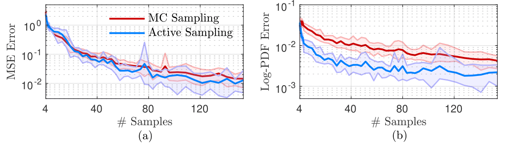

Clustering Analysis
-------------------
Upon selecting the training points, the next goal is to determine if the points that were chosen by Active Sampling have any relevant physical meaning. Are these points related to important system dynamics? Can these points be attributed to physical phenomena such as turbulence, atmospheric rivers, tropical cyclones, etc.? Does their physical interpretation depend on the target's predicted output? 

A framework is developed to mechanistically identify and define the dynamics of these points of interest. Clustering is applied to the original data set to build a grey-box reduced-order model of the dynamics of the system. Clustering is a form of reduced-order modeling in which observations are clustered into centroids.  In the case of a dynamic system, the observations are snapshots of the system. Cluster centroids are selected from the entire reference dataset of PCA coefficients using the standard $k$-means algorithm with $k$-means++ for seed initialization. The first step in all clustering methods is to choose the number of clusters, $K$. One popular method is the "elbow method" which involves calculating the within-cluster-sum of squared errors for multiple models with different values for $K$. Then, the user can choose the smallest $K$ that results in a low error. The resulting cluster centroids can be projected back onto the PCA modes (eigenvectors) to visualize the spatial patterns. These cluster centroids are then used to predict the cluster labels of the new subset of the data chosen by the active sampling algorithm. This step assigns the optimal points to relevant cluster centers which allow a scientist to determine if the points chosen by the active sampling algorithm are associated with noteworthy dynamical phenomena. The ultimate goal is to interpret the physical meaning of the points that were chosen for training.

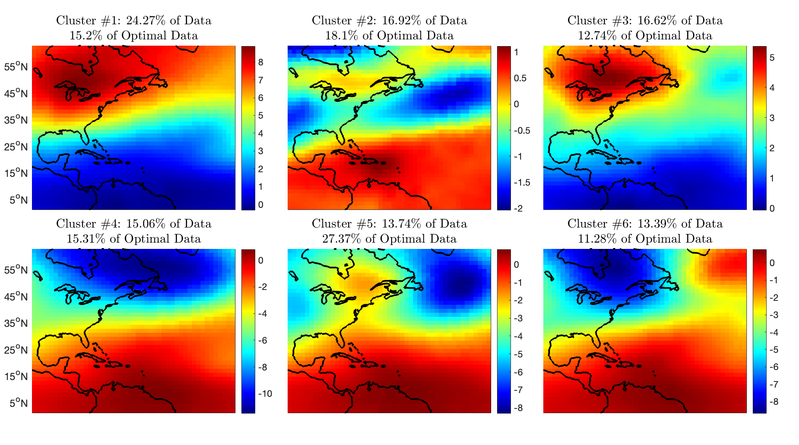
  
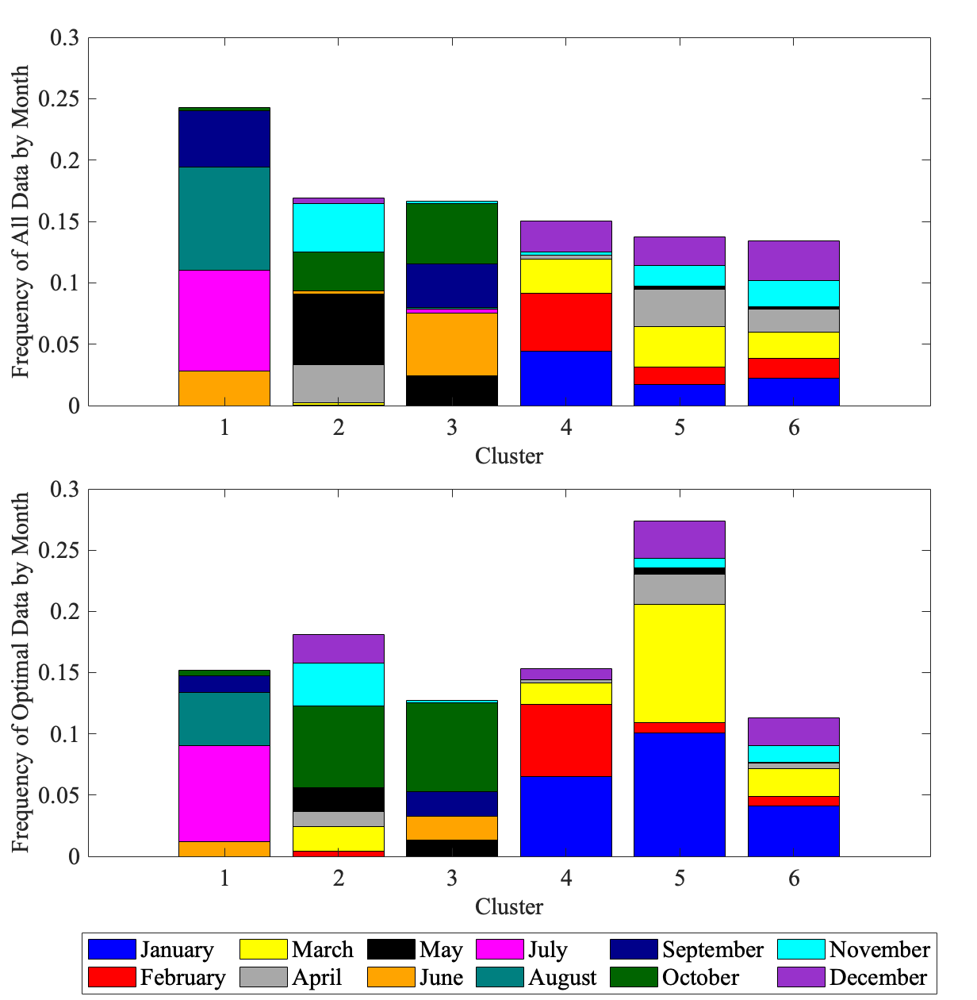
  
Code Setup
----------

1. To create a test case, simply add the case you want to the file Model_Cases.py. The file contains instructions on what each parameter represents. Make sure to set the parameters of the case to the ones you want and give a nickname to the case. The implementation of the method can be found [`here <https://www.dropbox.com/sh/j7hf8qvja44ghjq/AACYSeMHTNK68NP5mSbfQ5nOa?dl=0>`_]. If you want to double check that the parameters where set correctly for your run, simply type 

                 python ./Nonintrusive_Model.py test_case data_info 

and it will display on the command line the details for the run. 

2. The file used to run the code is Nonintrusive_Model.py. There are different handles you can include when calling this code which are described below:
           
           * data_info: To double-check that all parameters for the case you created were set correctly, simply run
           
                        python ./Nonintrusive_Model.py test_case data_info
                        
           
           * data_prep: Before training, the generation of appropriate data is required. To do this, type:
           
                        python ./Nonintrusive_Model.py test_case data_prep -handle
             
             where test_case is the name of the case you want to run. handle can be 'overlap' if you want the code to skip making files that already exist from previous runs, or 'clean' if you want the code to recreate all the files. 
           
           * train_model: To train the model, simply type: 
           
                        python ./Nonintrusive_Model.py test_case train_model -handle zlevel
           
             Again, handle can be 'overlap' or 'clean'. Furthermore, zlevel denotes the sigma-level that you want to train on. This process saves both validation results (i.e. with R-nudged data as input) and testing results (i.e. with CLIM data as input). 
           
           * compute_stats: To compute statistics from your results, simply type 
           
                        python ./Nonintrusive_Model.py test_case compute_stats -handle
           
           where handle can be 'overlap' or 'clean'. 
           
3. To perform the clustering analysis, simply use the scikit-learn KMeans function to train the model
           * model = KMeans(n_clusters=K).fit(data)
Here, the data variable is the PCA time coefficients and K is the number of clusters of your choice. The resulting model produces centroids and labels, and the model can be used to predict the labels of new points. The labels of the optimal training samples can be predicted as follows:
           * optimal_labels = model.predict(optimal_samples)

Numerical Results
-----------------

1. Hurricane Sandy 

             Hurricane Sandy was a tropical cyclone that affected the Caribbeans and the East Coast from 10/23/2012 to 11/02/2012. We train the model                using 2012 ERA5 and E3SM(NDGUVTQ). CLIM data are used during testing. The time-interval 10/23/2012-11/03/2012 is excluded from training. We then validate the model by comparing its predictiongs with Nudged data as input for the time-interval of the hurricane. The model can use ERA5 data as labels [`here <https://www.dropbox.com/s/7631nnd6x5q7gc0/TC_Speed_Isopressure_ERA5.mp4?dl=0>`_] as well as E3SM(NDGUVTQ) data [`here <https://www.dropbox.com/s/93ieajcq0ggph45/TC_Speed_Isopressure_Nudged.mp4?dl=0>`_]. Both cases are compared to the ground truth ERA5 dataset. Obviously, using ERA5 labels yields improved results.
             

2. Extratropical Cyclone 2016

             From 01/20/2016 to 01/26/2016, an extratropical cyclone affected the East Coast, resulting in heavy precipitation and snowfall. We train the model, using 2016 ERA5 data, with the time-interval 01/20/2016-01/26/2016 excluded from training. We then validate the model by comparing its predictiongs with Nudged data as input for the time-interval of the hurricane. The model can use ERA5 data as labels [`here <https://www.dropbox.com/s/432csh4rrf2pkie/ETC_Speed_Isopressure.mp4?dl=0>`_].

3. Mean IVT Predictions

To showcase the ability of the model to extract local features, the time-averaged integrated vapor transport is computed. Results are averaged over the time period 2007-2017. Integrated vapor transport is defined as

:math:`\text{IVT}(t,\phi,\theta) = \sqrt{\text{IVTU}^2(t,\phi,\theta) +\text{IVTV}^2(t,\phi,\theta)},`

where

:math:`\text{IVTU}(t,\phi,\theta) = \sum_{k=1}^{N_z}U(t,\phi,\theta;k) Q(t,\phi,\theta;k) \frac{\Delta P(t,\phi,\theta;k)}{P_m(t,\phi,\theta;k)},`

and

:math:`\text{IVTV}(t,\phi,\theta) = \sum_{k=1}^{N_z}V(t,\phi,\theta;k) Q(t,\phi,\theta;k) \frac{\Delta P(t,\phi,\theta;k)}{P_m(t,\phi,\theta;k)}.`

:math:`P_m` is the mean pressure at sigma-level :math:`k`, while :math:`\Delta P` is the total pressure along the vertical extent of the sigma-level. Results are shown below. The top row of each sibfigure displays the mean IVT as computed from ERA5 reanalysis data. The following two rows show the bias of other datasets compared to ERA5. The second rows show the bias for Nudged and CLIM datasets. Finally, the third row shows biases computed for the LSTM-corrected datasets produced with input data Nudged (validation) and CLIM (testing) respectively. Subfigure (a) corresponds to a neural-network that uses a global region from which it extracts all its features. Subfigure (b) corresponds to a neural-network that splits the domain into 25 subregions. Both models use the same total number of convolution filters. Hence, it is apparent that extracting local features yields considerable improvement in the predictions of strongly anisotropic fields like IVT. 

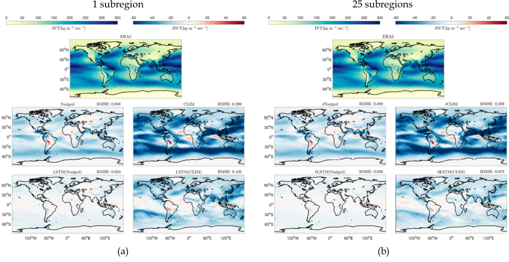
  
  
4. Evaluating out-of-sample strong El Nino

In this subsection we study the ability of the non-intrusive model to predict effects of strong El Ni\~no without including similar years in training. The term El Ni\~no stems from the warm phase of the El-Ni\~no-Southern Oscillation (ENSO). The plethora of indices used to monitor El Nino, are mostly based on sea-surface temperature (SST) anomalies averaged across a given region. Usually, the anomalies are computed relative to a base period of 30 years. However, Since we have 11 years of training data and the E3SM model receives SST as a boundary condition, we restrict our study in two ways. First, we study the time-interval 2015-2017, where a strong El Nino event was observed. Secondly, we replace SST with temperature at the lowest sigma-level of the atmosphere. Emulating the geographical extent of Ni\~no 3.4 index, which is the most commonly used index to define El Ni\~no events, we plot the monthly mean temperature deviations for the time period 2015-2017, for the geographical region :math:`[5\text{S},5\text{N}] \times [120\text{W},170\text{W}]`.

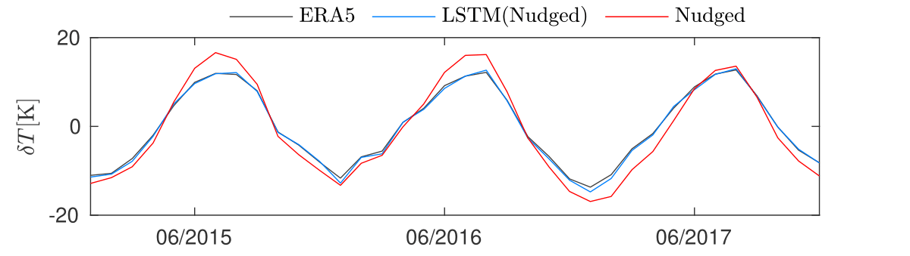
  
Results for the nudged simulation are shown in the figure above. The years 2015-2017 where excluded from training, and only data from the years 2007-2011 were included. In that time period, no strong El Ni\~no events were observed. However, the LSTM corrections can visible correct the over-predictions in the mean temperature variations, predicted by the Nudged E3SM simulation, compared to ERA5. This is a testament to the ability of the model to extrapolate to unseen data. 
  

