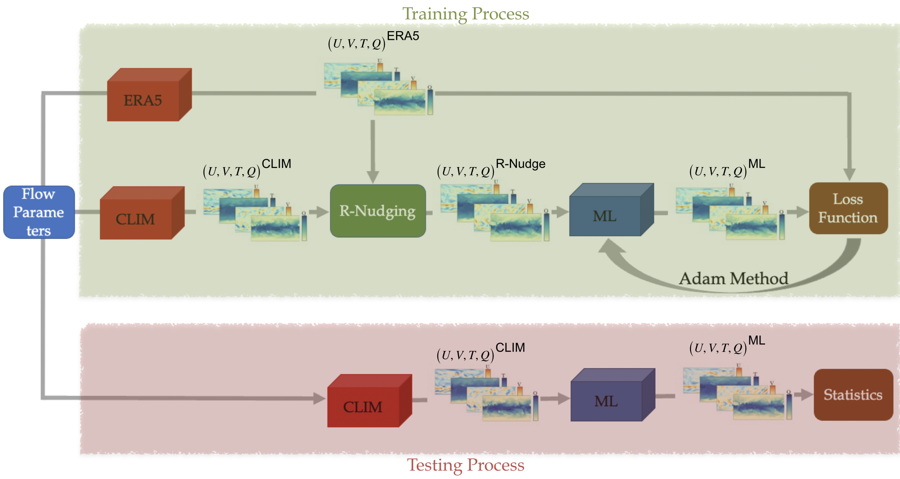
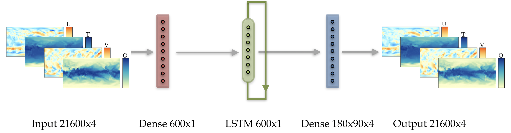
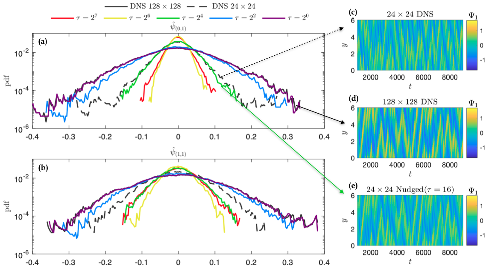
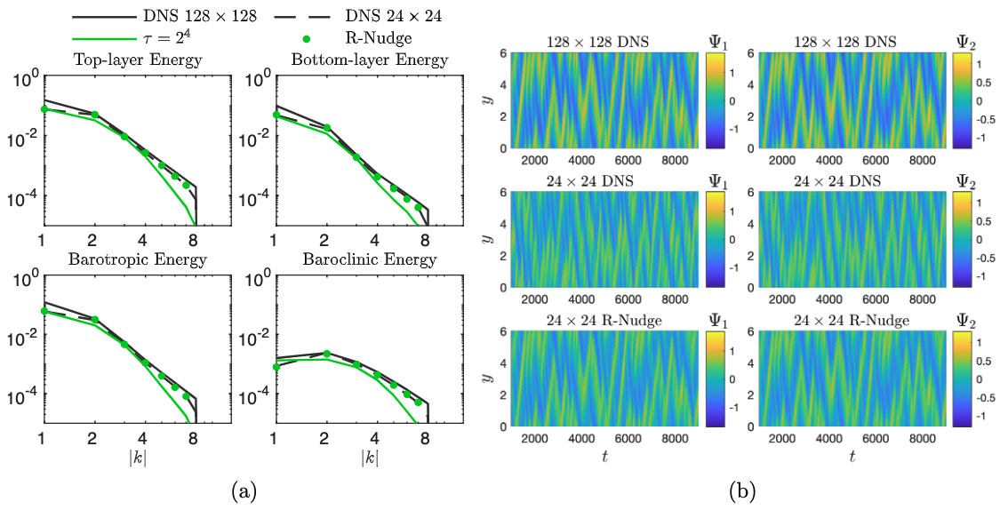
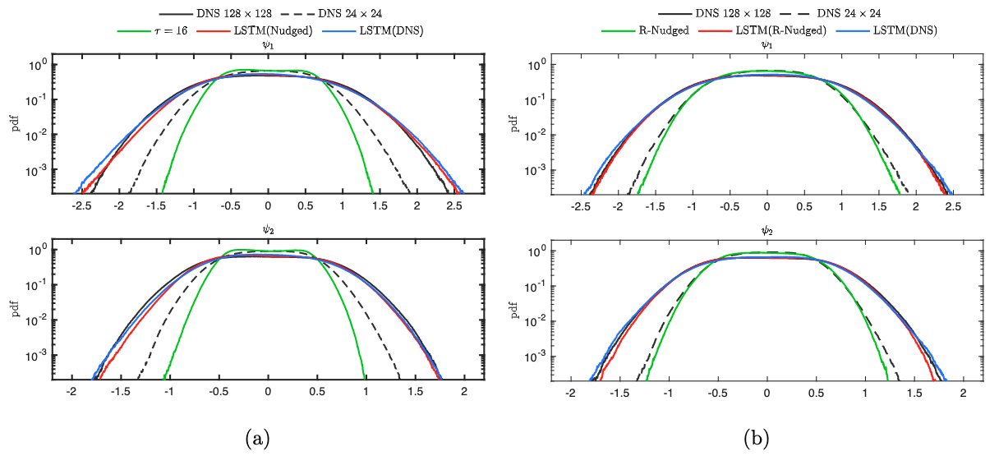
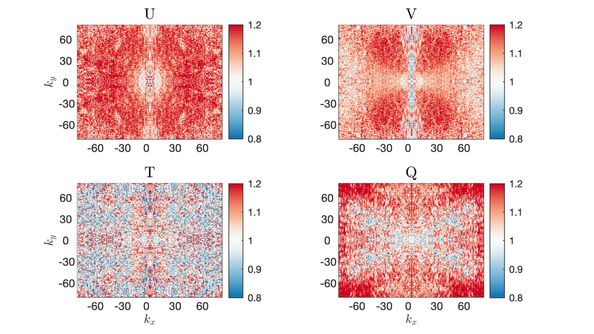

Non-intrusive LSTM architecture
===============================
Problem Setup
-------------

This work aims to train a neural network that, given as input the predictions of a free running coarse-
scale simulation, denoted as CLIM in this project, :math:`\left(U, V, Q, T\right)^{\text{CLIM}}`, it will produce a modified time-series :math:`\left(U, V, Q, T\right)^{\text{ML}}` that will have the same
statistics as a fine-scale reference simulation :math:`\left(U, V, Q, T\right)^{\text{ERA5}}`. For this
project, reference data correspond to ERA5 reanalysis datasets while free running coarse-scale
simulations are generated via the E3SM CLIM model. A diagram of this process is the figure below. The
de-coupling of the data-informed correction process and the initial simulation phase is justified by the
fact that the goal is not to make phase corrections at each time-step but retrieve the correct statistics
for the current flow parameters.

While testing will be carried out using free running coarse-scale data, appropriate training data need to
be determined first. Due to chaotic divergence, free running coarse-scale data will very quickly diverge
from their fine-scale conuterpart despite having the same flow parameters and initial conditions. As a
result, it is not feasible for a neural network to learn a generalizable mapping directly between
:math:`\left(U, V, Q, T\right)^{\text{CLIM}}` and :math:`\left(U, V, Q, T\right)^{\text{ERA5}}`. To
that end, to produce coarse-scale simulations for training, a relaxation term :math:`Q` is added to the
evolution equations of the prognostic variables :math:`\left(U, V, Q, T\right)`. The term :math:`Q` is called nudging tendency
and it corrects the coarse-scale solution based on the fine-scale reference solution. In this study, for a
variable :math:`X`, the nudging tendency :math:`Q` is given by the algebraic term

:math:`Q\left( X-X^{\text{ERA5}} \right) = -\frac{1}{\tau} \left( X-\mathcal{H} \left[X^{\text{ERA5}}\right] \right).`

Parameter :math:`\tau` is a relaxation timescale to be determined, and :math:`\mathcal{H}` is an operator
that maps :math:`X^{\text{ERA5}}` to the coarse resolution.

Model Architecture
------------------

This approach employs Long short-term memory (LSTM) neural networks. Of great interest is the ability of this model to generalize beyond the data seen during training. At first this is investigated in out-of-sample data from the training flow and later further tested
on different on unseen data. The architecture of the LSTM-based neural-network is shown in the figure
below. It consists of an input fully connected layer that compresses prognostic variables of a single level
to a 600-valued vector. This layer has a :math:`\tanh` activation function. The compressed vector
is then passed as input to a long short-term memory (LSTM) neural network. The output of the neural network is then passed through an output fully connected neural network to produce the final data-informed corrected predictions. The output layer has a linear activation function.

LSTM neural networks incorporate (non-Markovian) memory effects into the reduced-order model. This
ability stems from Takens embedding theorem. The theorem states that given delayed embeddings of a
limited number of state variables, one can still obtain the attractor of the full system for the observed
variables. This approach is known to be capable of improving predictions of reduced-order models.
Hence, it is expected that RNNs can help predict the contribution of unresolved scales.

Data Preparation
----------------

1. Lessons from beta-testing

This approach was first applied to a simpler, 2-layer quasi-geostrophic model. While using nudged data, one can hope that by using small :math:`\tau` they can get nudged dataset with the statistical properties of the free-running coarse-scale simulation but much lower phases errors with respect to the reference solution. However, as can be seen from the figure below, this is not possible. In fact, nudging can make the statistical properties of predictions worse than that of a free-running coarse simulation. Similar behavior was observed on the E3SM dataset. Furthermore, even by hand-picking a value of :math:`\tau` so to match the statistics of the coarse simulation for one feature, the statistics will diverge for the others. This is a result
of discrepancies in the energy spectrum of the nudged solution with respect to the coarse-scale
solution.

To remedy the energy spectra differences, a new method is developed and employed. The process is
called "Reverse Spectral Nudging" with its purpose being to match the energy spectrum of the nudged
solution to that of the coarse-scale solution to improve the training process. While traditional nudging schemes correct the coarse-scale solution with data from the reference solution, the proposed scheme further processes the nudged data by matching its energy spectrum to that of the
corresponding free running coarse-scale flow. The corrected nudged data is termed as :math:`\left( U,
V, Q, T \right)^{\text{R-Nudge}}` and defined, for a prognostic variable :math:`X`, as

:math:`X^{\text{RS-nudge}}\left(x, y t; z=z_0\right) = \sum_{k,l} R_{k,l} \hat{X}_{k,l}^{\text{nudge}}(t;z=z_0) e^{i\left( k x +l y \right)},`

where :math:`{X}_{k,l}^{\text{nudge}}(t)` are the spatial Fourier coefficients of :math:`X^{\text{nudge}}` and

:math:`R_{k,l} = \sqrt{\frac{\mathcal{E}^{\text{coarse}}_{k,l}}{\mathcal{E}^{\text{nudge}}_{k,l}}}, \quad\text{and} \quad \mathcal{E}_{k,l} = \frac{1}{T}\int_0^T \hat{E}_{k,l}(t) \mathrm{d}t =\frac{1}{T} \int_0^T|\hat{X}_{k,l}(t)|^2 \mathrm{d}t.`

The resulting dataset can be seen in the figure below.

This approach yielded improved results in the 2-layer QG model that were able to generalize outside the training set. 

2, Application to climate datasets.

While traditional nudging schemes correct the coarse-scale solution with data from the reference solution, the proposed
scheme further processes the nudged data by matching its energy spectrum to that of the
corresponding free running coarse-scale flow. The corrected nudged data is termed as :math:`\left( U,
V, Q, T \right)^{\text{R-Nudge}}` and defined, for a prognostic variable :math:`X`, as

:math:`X^{\text{RS-nudge}}\left(x, y t; z=z_0\right) = \sum_{k,l} R_{k,l} \hat{X}_{k,l}^{\text{nudge}}(t;z=z_0) e^{i\left( k x +l y \right)},`

where :math:`{X}_{k,l}^{\text{nudge}}(t)` are the spatial Fourier coefficients of :math:`X^{\text{nudge}}` and

:math:`R_{k,l} = \sqrt{\frac{\mathcal{E}^{\text{CLIM}}_{k,l}}{\mathcal{E}^{\text{nudge}}_{k,l}}}, \quad\text{and} \quad \mathcal{E}_{k,l} = \frac{1}{T}\int_0^T \hat{E}_{k,l}(t) \mathrm{d}t =\frac{1}{T} \int_0^T|\hat{X}_{k,l}(t)|^2 \mathrm{d}t.`

A depiction of the values of these coefficients can be seen in the figure below.

An important property of this scheme is that the new data have exactly the energy spectrum of the free
running coarse simulation, meaning that the training and testing data come from the same distributions.
This property improves significantly the accuracy of the resulted ML scheme. The energy spectra of the
R-nudged solution indeed coincide with the coarse-scale free running spectra. In addition, the R-nudged data still follow the reference data, allowing for a mapping between :math:`\left( U,V,T,Q\right)^{\text{R-Nudge}}` and :math:`\left( U,V,T,Q \right)^{\text{ERA5}}`. This process does not
require running additional nudged simulations, thus lowering the total cost of the training scheme.

Code Setup
----------

1. To create a test case, simply add the case you want to the file Model_Cases.py. The file contains instructions on what each parameter represents. Make sure to set the parameters of the case to the ones you want and give a nickname to the case. If you want to double check that the parameters where set correctly for your run, simply type 

                 python ./Nonintrusive_Model.py test_case data_info 

and it will display on the command line the details for the run. 

2. The file used to run the code is Nonintrusive_Model.py. There are different handles you can include when calling this code which are described below:
           
           * data_info: To double-check that all parameters for the case you created were set correctly, simply run
           
                        python ./Nonintrusive_Model.py test_case data_info
                        
           
           * data_prep: Before training, the generation of appropriate data is required. To do this, type:
           
                        python ./Nonintrusive_Model.py test_case data_prep -handle
             
             where test_case is the name of the case you want to run. handle can be 'overlap' if you want the code to skip making files that already exist from previous runs, or 'clean' if you want the code to recreate all the files. 
           
           * train_model: To train the model, simply type: 
           
                        python ./Nonintrusive_Model.py test_case train_model -handle zlevel
           
             Again, handle can be 'overlap' or 'clean'. Furthermore, zlevel denotes the sigma-level that you want to train on. This process saves both validation results (i.e. with R-nudged data as input) and testing results (i.e. with CLIM data as input). 
           
           * compute_stats: To compute statistics from your results, simply type 
           
                        python ./Nonintrusive_Model.py test_case compute_stats -handle
           
           where handle can be 'overlap' or 'clean'.
           
           * make_video: To create a video from your datasets, simply type 
           
                        python ./Nonintrusive_Model.py test_case make_video
           
           There are specific parameters that need to be set in Model_Cases.py for what field to plot and over what region. 
           

Numerical Results
-----------------

1. Hurricane Sandy 

             Hurricane Sandy was a tropical cyclone that affected the Caribbeans and the East Coast from 10/23/2012 to 11/02/2012. We train the model,                using 2012 ERA5 and E3SM(NDGUVTQ). CLIM data are used during testing. The time-interval 10/23/2012-11/03/2012 is excluded from training. We then validate the model by comparing its predictiongs with R-nudged data as input for the time-interval of the hurricane. The model can use ERA5 data as labels [`here <https://www.dropbox.com/s/7631nnd6x5q7gc0/TC_Speed_Isopressure_ERA5.mp4?dl=0>`_] as well as E3SM(NDGUVTQ) data [`here <https://www.dropbox.com/s/93ieajcq0ggph45/TC_Speed_Isopressure_Nudged.mp4?dl=0>`_]. Both cases are compared to the ground truth ERA5 dataset. Obviously, using ERA5 labels yields improved results.

